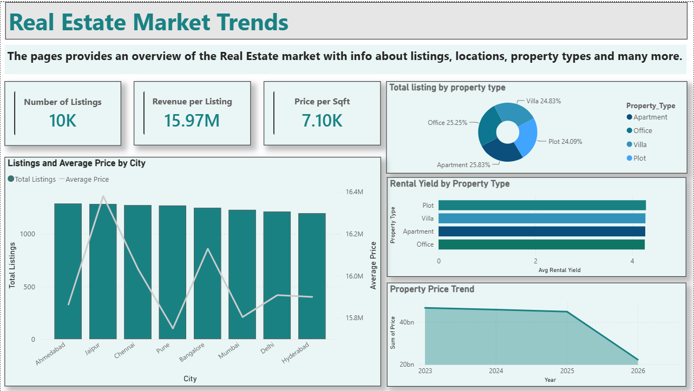
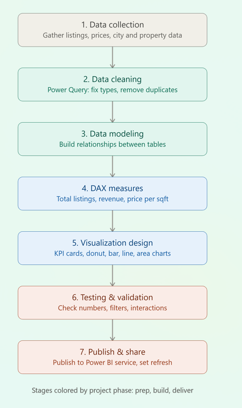

# 🏡 Real Estate Market Trends Dashboard | Power BI



## 📌 Project Overview

This project presents an interactive Power BI dashboard that analyzes **10,000+ real estate listings** to uncover valuable market insights. The dashboard helps users understand pricing trends, rental yields, property distribution, and city-wise performance through dynamic visualizations and KPIs.

---

## 🎯 Objectives

- Analyze real estate market trends.
- Compare property prices across major cities.
- Monitor rental yield by property type.
- Track yearly price trends.
- Build an interactive Business Intelligence dashboard.

---

## 📊 Dashboard KPIs

- Total Listings
- Revenue per Listing
- Average Price per Sqft
- Rental Yield
- Property Type Distribution
- City-wise Listings
- Average Property Price
- Yearly Property Price Trend

---

## 📈 Dashboard Preview



---

## 🛠️ Tools & Technologies

- Power BI Desktop
- Microsoft Excel
- Power Query
- DAX
- Data Modeling
- Data Visualization

---

## 📁 Dataset

The dataset contains over **10,000 real estate listings** with attributes such as:

- Property Type
- City
- Price
- Area (Sqft)
- Rental Yield
- Revenue
- Listing Date

---

## 🚀 Features

- Interactive Dashboard
- Dynamic Filters
- KPI Cards
- Pie Charts
- Line Charts
- Column Charts
- Business Insights
- Responsive Layout

---

## 💼 Business Insights

- Identify cities with the highest property prices.
- Analyze rental yield by property type.
- Compare property distribution across locations.
- Monitor annual market growth.
- Support investment decision-making.

---

## 📂 Repository Structure

```
Real-Estate-Market-Trends-PowerBI-Dashboard
│
├── Dashboard Screenshot.png
├── RealEstateDashboard.pbix
├── Real_Estate_Market_Trends_10000.xlsx
├── README.md
├── LICENSE
└── Assets/
      ├── dashboard.png
      ├── overview.png
      └── icons/
            ├── excel.png
```

---

## 👨‍💻 Skills Demonstrated

- Business Intelligence
- Dashboard Design
- Data Analysis
- Power BI
- DAX
- Power Query
- Data Cleaning
- Data Modeling
- Data Visualization

---

## 🔮 Future Improvements

- Forecasting
- Drill-through Reports
- Mobile Layout
- Live API Integration
- Geographic Maps

---

## ⭐ If you like this project, don't forget to star the repository!
